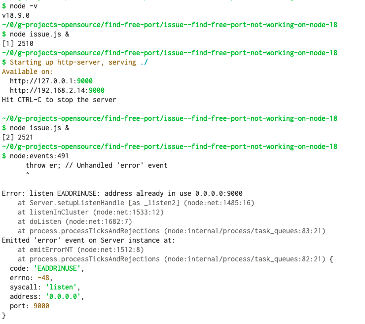
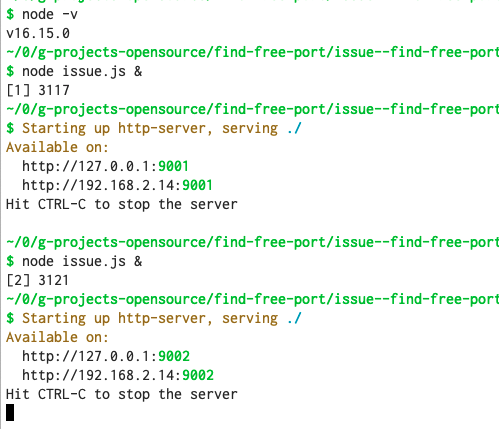

https://github.com/mhzed/find-free-port/issues/11

## To reporduce bug:

```
nvm use 18
node issue.js &
node issue.js & 
```



## works in node-v16

```
nvm use 16
node issue.js &
node issue.js & 
```

